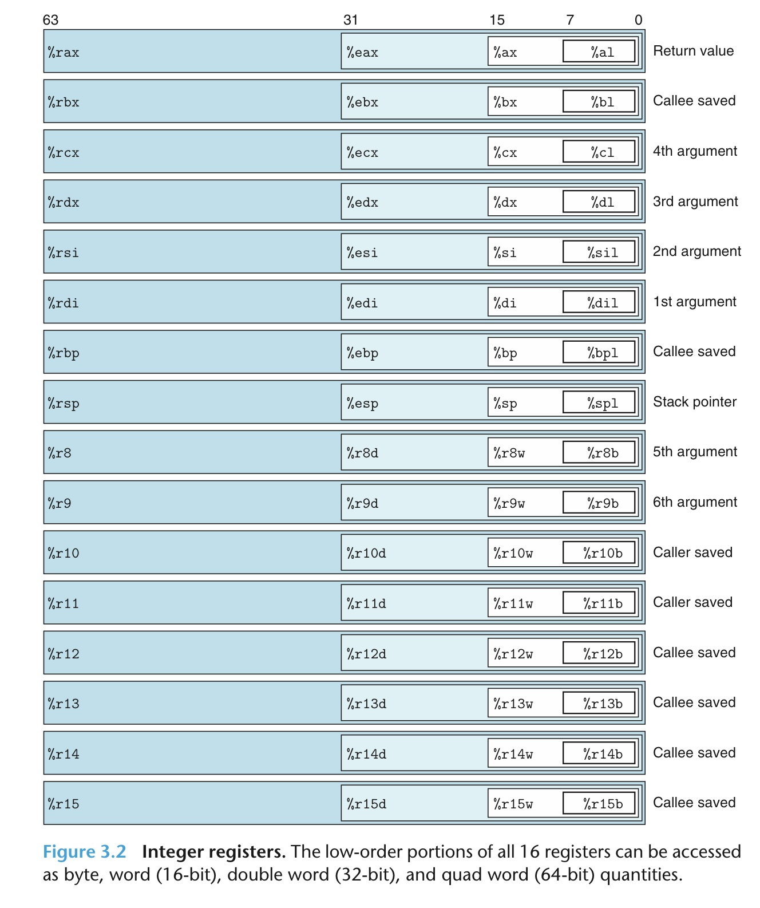
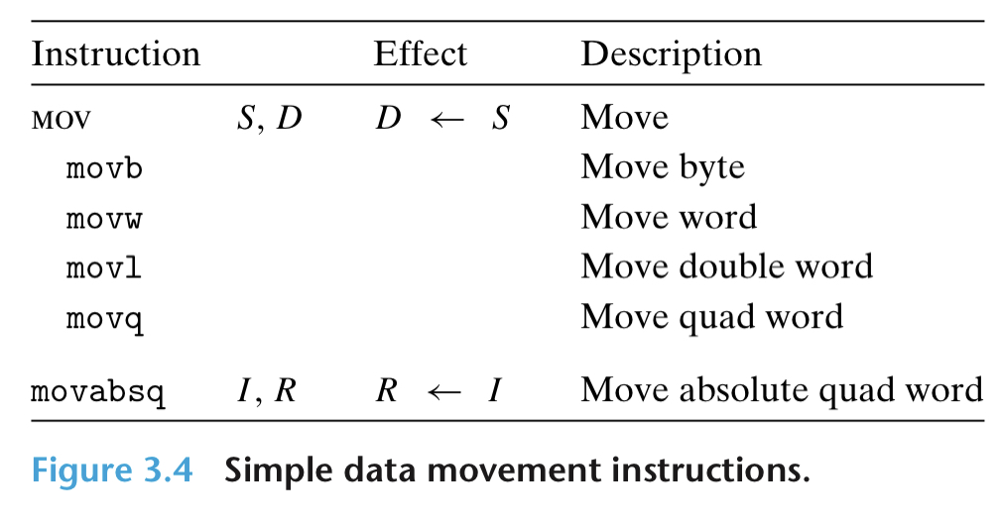
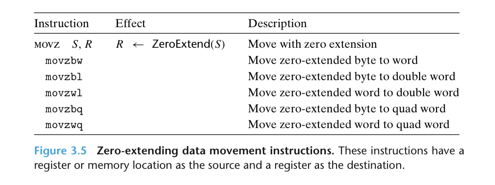
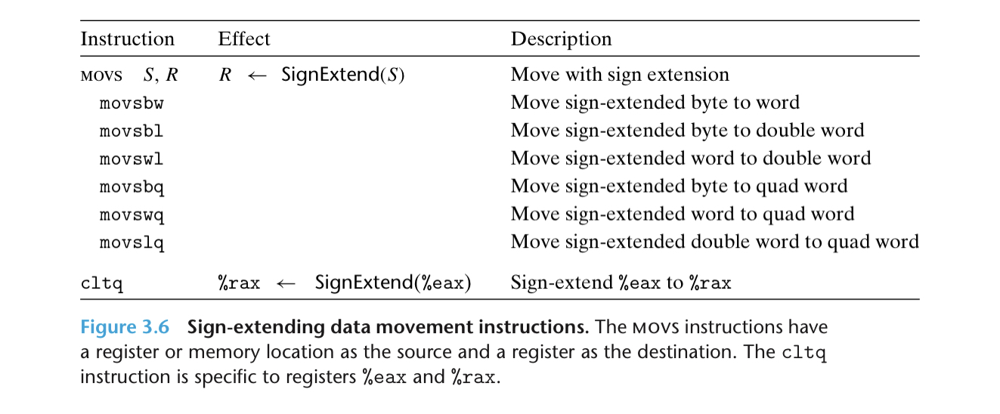
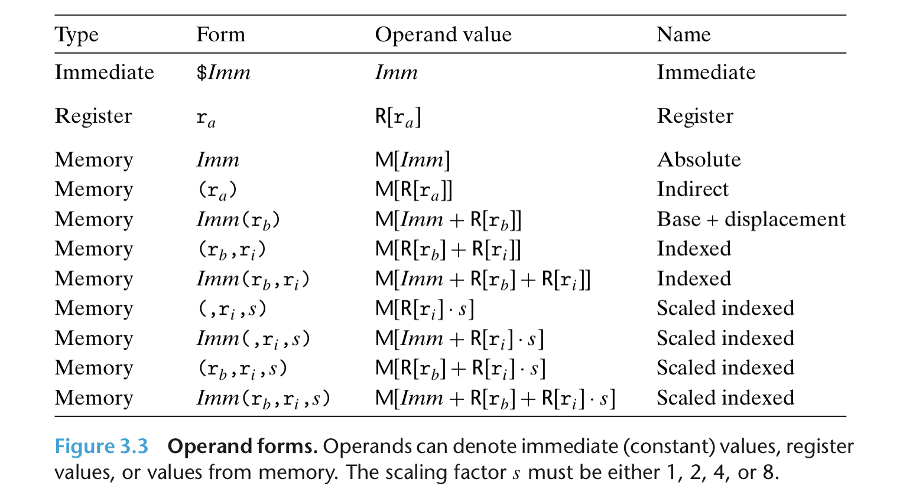

# refs

    https://en.wikibooks.org/wiki/X86_Assembly/X86_Architecture

# x86 通用寄存器

1. 通用寄存器

    

    现今 x86_64 架构有 16 个通用寄存器 （早期 8086 时期只有前 8 个）

    注释：
    
    1. Accumulator register (AX). Used in arithmetic operations

    2. Counter register (CX). Used in shift/rotate instructions and loops.
    3. Data register (DX). Used in arithmetic operations and I/O operations.
    4. Base register (BX). Used as a pointer to data (located in segment register DS, when in segmented mode).
    5. Stack Pointer register (SP). Pointer to the top of the stack.
    6. Stack Base Pointer register (BP). Used to point to the base of the stack.
    7. Source Index register (SI). Used as a pointer to a source in stream operations.
    8. Destination Index register (DI). Used as a pointer to a destination in stream operations.
    9. r8 - r15

    归属权：

    * Argument
        * rdi
        * rsi
        * rdx
        * rcx
        * r8
        * r9
    * Caller saved
        * r10
        * r11
    * Callee saved
        * rbx
        * rbp
        * r12
        * r13
        * r14
        * r15
    * return value
        * rax
    * stack pointer
        * rsp


# x86 汇编简介

## 1. 汇编代码结构

```opcode src_oprand, dst_oprand...```

例如
```

## 2. opcode 规则

以mov为例
```asm
movq (%rdi), %rax //把rdi指向的内存的数据搬到寄存器rax
```

## 2. opcode 规则

以mov为例


### 指定位宽：



* b 结尾：1byte

* w 结尾： 2bytes
* l 结尾： 4byte
* q 结尾： 8bytes

    moveq 最大load 32 bits imm，但是用 moveabsq 可以 load 64 bits imm

### 零拓展：



* z 结尾： 零拓展

### 符号拓展



* s 结尾： 符号拓展


## 3. oprand 规则



* 立即数： ```$``` 开头

* 寄存器： ```%``` 开头

* 内存引用： ```()``` 括住
