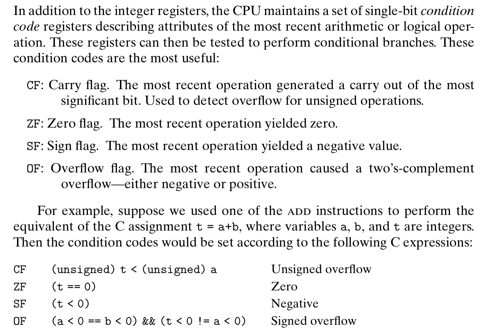
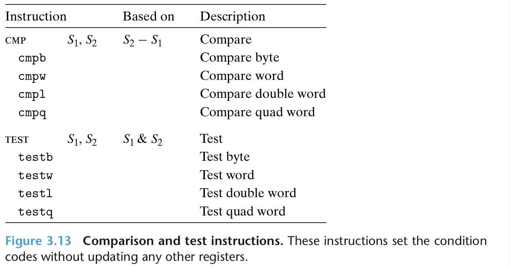
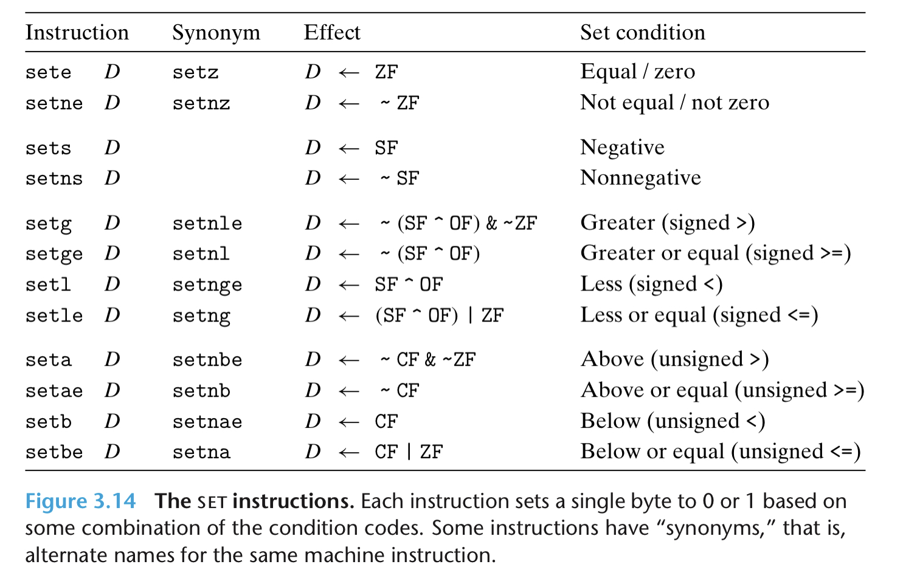
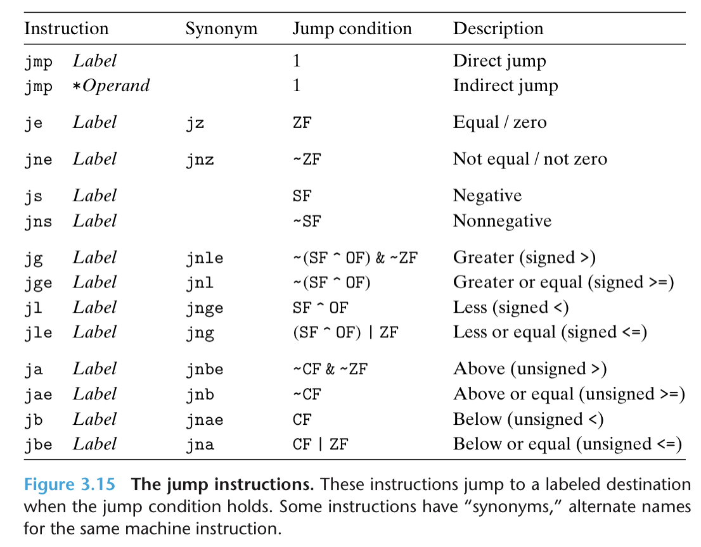

# MOV


注意，move 的源和目的不能同时为内存地址

# PUSH & POP

压栈指令 push （vice versa）等价于：
```
sub $8, %rsp 
mov %xxx, (%rsp)
```


# LEA (Load Effective Address)

实际等价于源使用类似内存引用算法的 mov


# 算术和逻辑运算

注意区分算术右移和逻辑右移


# Control

## 条件码寄存器

保存上一次运算指令的结果的状态



## comp and test

注意其中比较的讨论对象是 S2 对于 S1


## 读条件寄存器



条件传送指令 CMOV

## 跳转

