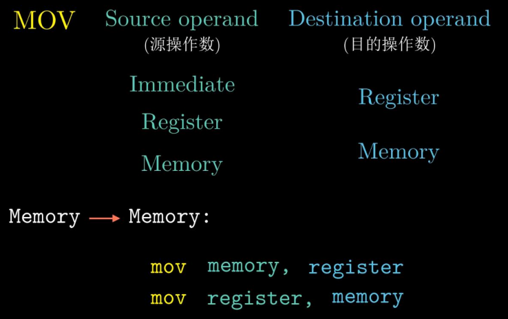
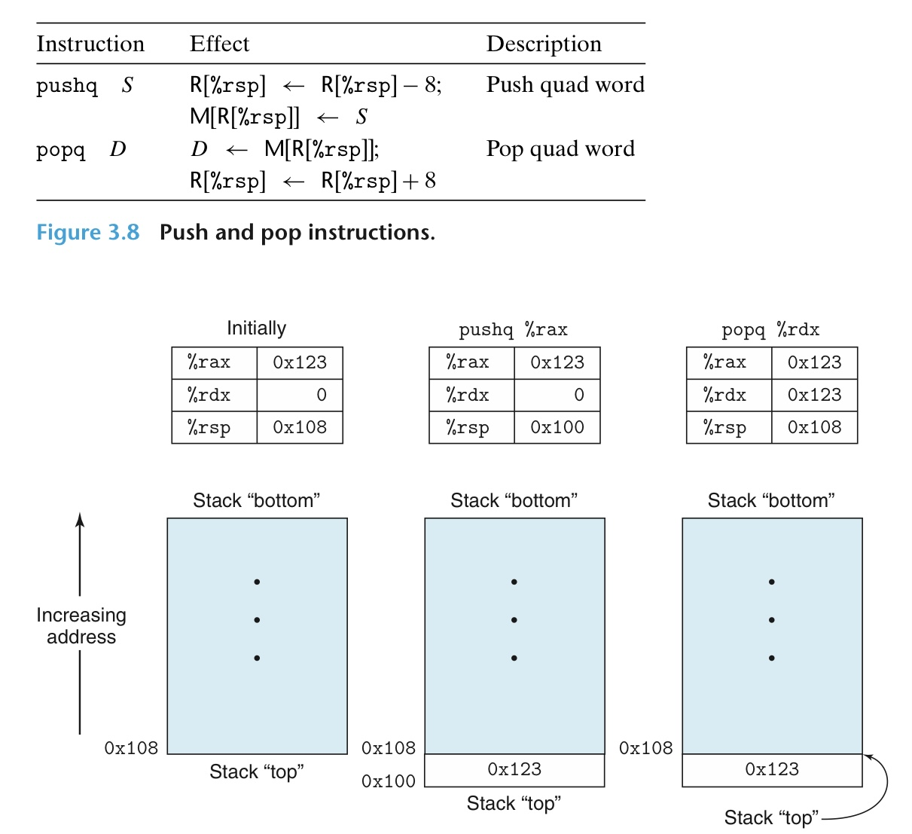
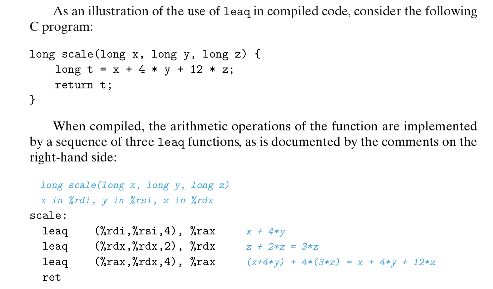
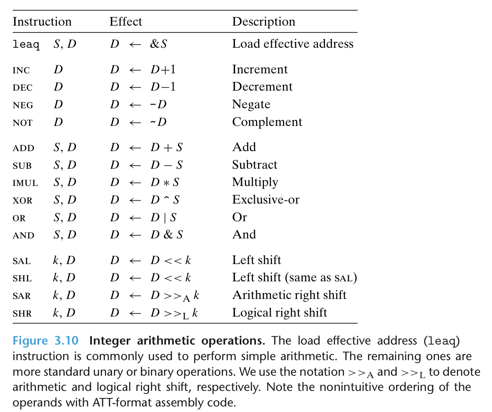

# MOV



注意，move 的源和目的不能同时为内存地址

# PUSH

压栈指令 push （vice versa）等价于：
```
sub $8, %rsp 
mov %xxx, (%rsp)
```



# LEA (Load Effective Address)

实际等价于源使用类似内存引用算法的 mov



# 算术和逻辑运算

注意区分算术右移和逻辑右移



