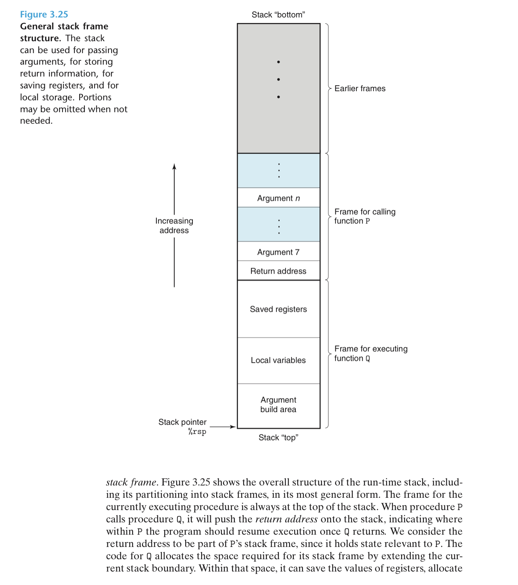

# 栈帧

栈帧是当前运行状态下某一时刻运行时栈的快照

return address：函数返回退出后下一条要执行的指令的地址

argument：无法通过寄存器传递的函数参数则通过内存传递

saved register：Caller 使用过的寄存器（Callee saved register）若 Callee 也需要使用，则需要把 Caller 调用函数时寄存器的状态保存到内存里，函数结束后再恢复到寄存器

