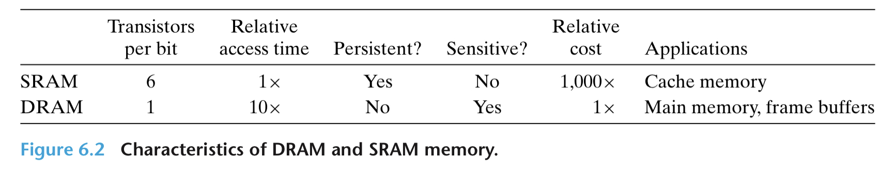
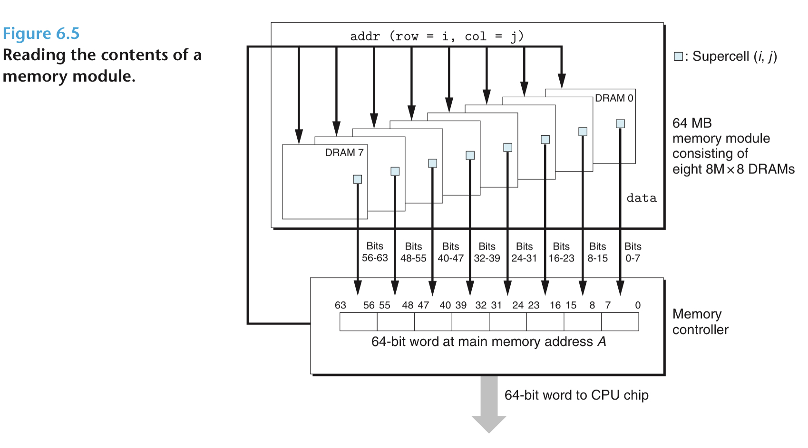
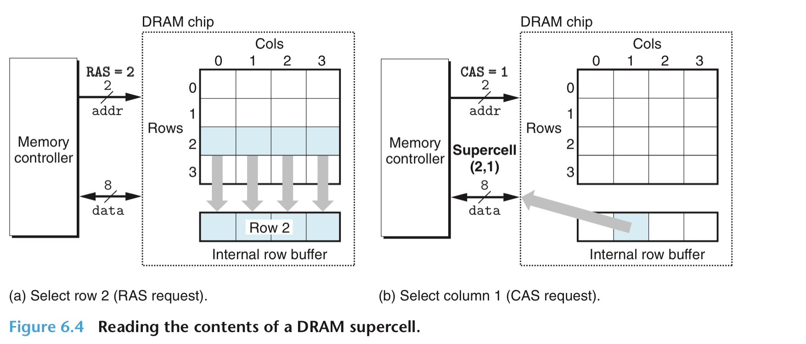

# Random Access Memory

RAM 分为 SRAM 和 DRAM，SRAM 通常用于 cache，而 DRAM 用与内存或显存

## SRAM：
SRAM将每个位存储在一个双稳态（bistable）存储单元中。每个单元由一个六晶体管电路实现。这种电路的特性是，它可以无限期地保持在两种不同的电压配置或状态中的任何一种。

## DRAM：
DRAM将每个比特存储为电容器上的电荷，断电数据即丢失，需要定期充电，内存系统必须定期刷新内存中的每一个位，将其读出，然后重新写入。并且 DRAM 更容易受到电磁干扰。

DRAM 取数据示例图：

通常一个 64bits 数据被分布地存在 8 个 dram 芯片中，每次存取并行操作，取数据时在每个芯片中取其中一个 supercell 的内容（通常为 8 bits）最终拼出完整的 64 bits。

对于一个 dram 芯片，每次读取 controller 发送行地址，读一行到 internal row buffer，随后再发送列地址，在 buffer 内到所在列读取。这样设计的目的是节省引脚（例如 $16 = 2^4$ 需要 4 个引脚去代表地址，但若将其以开二次方根为边长分组排列，则 $ \sqrt{16} = 4 = 2 ^ 2$ 只需要 2 个引脚去代表地址）。

DDR3 是指 internal row buffer 的大小为 $ 2 ^ 3 $  

RAM 容量计算：

$1 TB = 2 ^ {10} GB = 2 ^ {20} KB = 2 ^ {30} B$