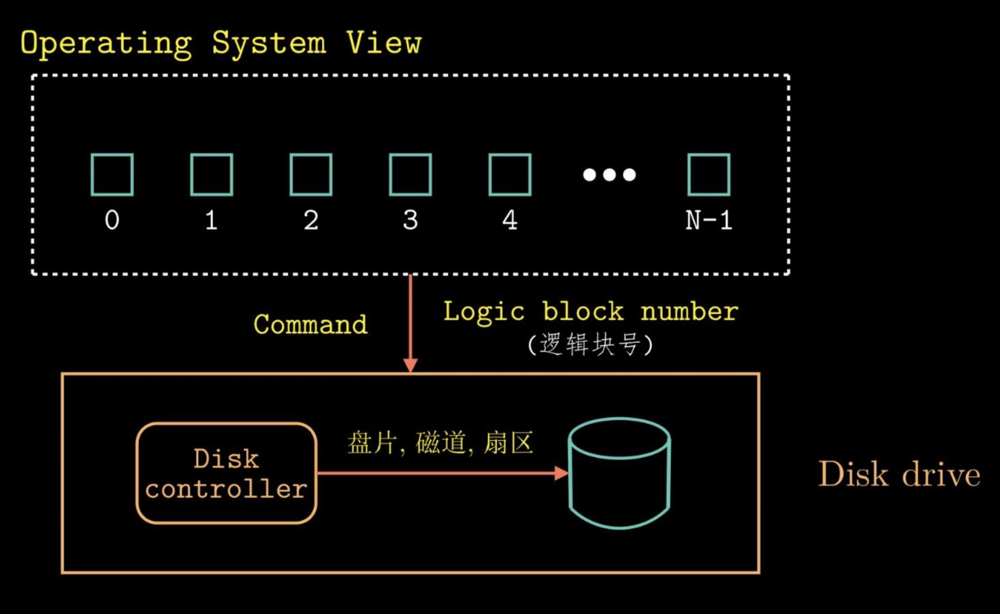
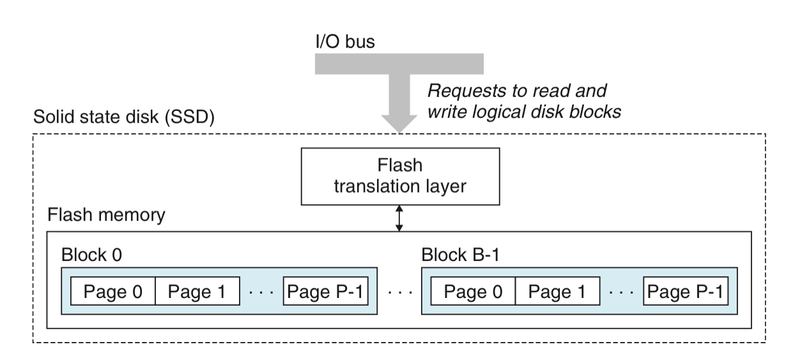
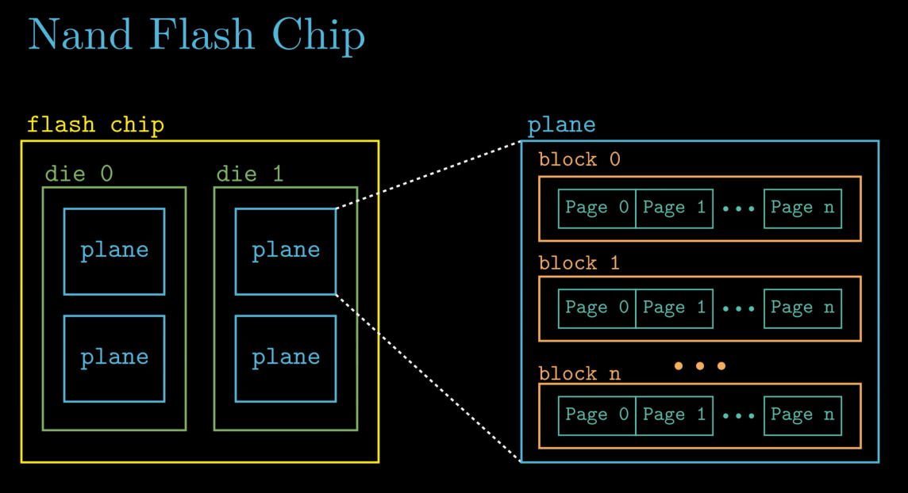

# 操作系统视角下的硬盘

操作系统视角下的硬盘被抽象成了一些逻辑数据块，每个数据块 512 bytes

读写数据时由 Disk controller 翻译成具体的物理地址

# 机械硬盘

机械硬盘示例图：

基本原理：

* 传动臂带动磁头移动到目标所在磁道，双向移动

* 主轴带动盘片使目标所在扇区对准磁头，单向旋转

硬盘容量计算：

$1 TB = 10 ^ 3 GB = 10 ^ 6 KB = 10 ^ 9 B$

磁盘操作：

* 读取一个扇区的总时间：

$$T_{access} = T_{seek} + T_{rotation} + T_{transfer}$$

* $T_{seek}$：寻道时间
    * $T_{avg\_seek} \approx 9ms$

* $T_{rotation}$：盘片旋转时间
    * 以 7200 RPM 为例：
        
        $T_{max\_rotation} = 60 sec * 1000 ms / 7200 RPM$

        $T_{avg\_rotation} = T_{max\_rotation} / 2 \approx 4ms$

* $T_{transfer}$：数据传输时间
    * 以平均每磁道 400 个扇区为例：

        $T_{avg\_transfer} = T_{max\_rotation} / 400 \approx 0.02ms$

# 固态硬盘

## SSD 示例 

## Nand Flash Chip

大多数 SSD 硬盘采用了 Nand flash chip 技术，其组成如下

