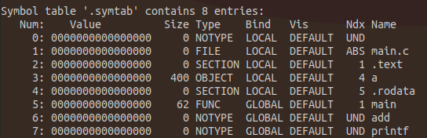

# 可重定位目标文件 (Relocatable Object Files)

## ELF (Executable and Linkable Format)


## ELF 重要组成部分

1. .text (Text Section):
这是存放程序的代码指令的区域。在该Section中，包含了编译后的机器代码，即CPU执行的指令。该区域通常是只读的，因为代码段应该是只读的，以确保程序执行期间不会被意外修改。

2. .data (Data Section):
在这个Section中，存放程序中需要初始化的全局和静态变量。这些数据在程序运行时可以被修改，因此该区域是可写的。数据段的初始化在程序启动时完成。

3. .bss (Block Started by Symbol Section):
在这个Section中，存放未初始化的全局和静态变量。这些变量在程序运行时会被初始化为0或空值。由于这些变量未被实际初始化，因此在ELF文件中不占用存储空间。bss段也是可写的。

4. .rodata (Read-Only Data Section):
这个Section中存放只读数据，例如常量字符串等。这些数据在程序运行期间不可修改，因此是只读的。

5. .debug (Debug Information Section):
这个Section用于存放调试信息，例如符号表、源代码行号信息、类型信息等。在调试或程序分析时，这些信息对于理解程序行为和定位错误非常有用。

## 符号表

```$ readelf -s ./main.o```



* value：地址对于所在 section 的偏移量

* size：大小（byte）

* Type：符号所指类型

* Bind：编译可见性（LOCAL为仅单元内可见）

* Ndx：所在 section 的索引

* Name：符号名
